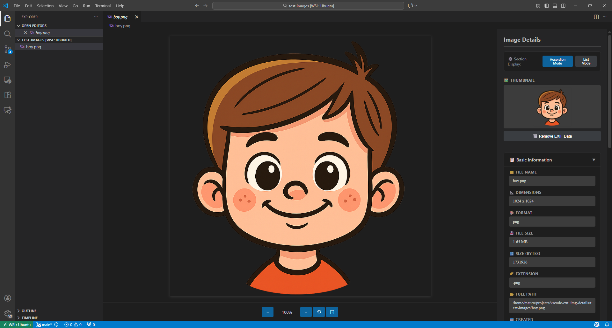

# Image Details

A powerful VS Code extension that displays comprehensive image metadata, EXIF data, and provides tools to clean metadata from images.

[](https://marketplace.visualstudio.com/items?itemName=NeuronioAzul.image-details)
[](https://marketplace.visualstudio.com/items?itemName=NeuronioAzul.image-details)
[](https://marketplace.visualstudio.com/items?itemName=NeuronioAzul.image-details)
[](https://opensource.org/licenses/MIT)
[](https://www.typescriptlang.org/)

## Screenshots

<!-- TODO: Add screenshots here -->


Demonstration of copying metadata values to clipboard:


## ✨ Features

### Comprehensive Metadata Display

You can click any metadata value to copy it to clipboard.

- **Basic Informations about the Image**:
  - File name and full path
  - Dimensions (width × height in pixels)
  - Image format and file extension
  - File size (auto-formatted: Bytes, KB, MB, GB)
  - Creation and modification timestamps
  - And more...

- **Color & Technical Information**
  - Transparency support detection
  - Color depth and bit information
  - DPI/PPI resolution data (when available)
  - And more...

- **📷 EXIF Data Support**
  - EXIF metadata for photos (when available):
  - **Camera Information**:
    - Camera make and model
    - Lens information
  - **Photo Settings**:
    - ISO sensitivity
    - Aperture (f-stop)
    - Shutter speed (exposure time)
    - Focal length
  - **Additional Data**:
    - Date and time taken
    - GPS location (latitude, longitude)
    - Image orientation
    - Color space information
    - Software/editor used

### Supported Image Formats

Works with all common image formats:

- PNG (`.png`)
- JPEG (`.jpg`, `.jpeg`)
- GIF (`.gif`)
- WebP (`.webp`)
- BMP (`.bmp`)
- SVG (`.svg`)
- ICO (`.ico`)

## Usage

### Quick Start

1. **Open any image file** in VS Code (supports PNG, JPG, GIF, WebP, BMP, SVG, ICO)
2. The extension **automatically activates** and displays the Image Details Viewer
3. View comprehensive metadata in the **resizable sidebar** on the right
4. **Click any metadata value** to instantly copy it to your clipboard
5. **Use zoom controls** to inspect images in detail

### Interacting with Images

#### Advanced Zoom Controls

- **Buttons**: Use the visual `+`, `-`, `⟲`, and `⊡` buttons in the toolbar
- **Keyboard**: Press `+` to zoom in, `-` to zoom out, `0` to reset
- **Mouse Wheel**: Hold `Ctrl` (Windows/Linux) or `Cmd` (Mac) and scroll
- **Click**: Click anywhere on the image to toggle 2× zoom
- **Fit to Screen**: Click the fit button to auto-adjust image size

### EXIF Data Management

- **Remove EXIF Metadata**: One-click button to strip all EXIF data from images
- **Automatic Backup**: Creates a backup file (`_backup`) before removing metadata
- **Format Support**: Works with JPEG/JPG and PNG images
- **Smart Detection**: Button only appears when image contains EXIF data
- **Safe Operation**: Confirmation dialog prevents accidental removal
- **Error Recovery**: Automatically restores from backup if operation fails
- **Real-time Update**: Interface refreshes automatically after metadata removal

### Internationalization (i18n)

- **Multi-language Support**:
  - 🇺🇸 English (default)
  - 🇧🇷 Português (Brasil)
- **Automatic Detection**: Uses your VS Code language settings
- **Easy to Extend**: Add your own language (see [I18N.md](docs/contributing/I18N.md))

#### Metadata Panel

- **Resize**: Drag the left edge of the panel to adjust width (250-600px)
- **Copy Values**: Click any metadata value to copy it to clipboard
- **Scroll**: Panel stays sticky on the right while scrolling large images

### Alternative Ways to Open

1. **Context Menu**: Right-click any image file in Explorer → **"Open with Image Details Viewer"**
2. **Command Palette**: Press `Ctrl+Shift+P` / `Cmd+Shift+P` → Type "Reopen with" → Select "Image Details Viewer"
3. **Default Viewer**: The extension registers as the default viewer for supported image formats

## Installation

### From VS Code Marketplace

1. Open VS Code
2. Go to Extensions (`Ctrl+Shift+X` / `Cmd+Shift+X`)
3. Search for "Image Details"
4. Click Install

### From Source

```bash
git clone https://github.com/NeuronioAzul/vscode-ext_img-details.git
cd vscode-ext_img-details
npm install
npm run compile
```

Then press `F5` to run in development mode.

## ⚙️ Configuration

The extension provides comprehensive configuration options. See the [full documentation](docs/README.md) for details.

### Available Settings

- `imageDetails.defaultDisplayMode`: Choose between accordion or list mode for metadata sections
- `imageDetails.defaultSectionStates`: Configure which sections are expanded by default
- `imageDetails.rememberSectionStates`: Enable/disable session persistence

For more details, see the [Configuration Guide](docs/README.md).

## 🤝 Contributing

Contributions are welcome! Please read our [Contributing Guide](docs/contributing/CONTRIBUTING.md) for details on:

- Reporting bugs
- Suggesting features
- Adding translations
- Submitting pull requests

## 📚 Documentation

Complete documentation is available in the [`docs/`](docs/) folder:

- [📖 Documentation Index](docs/README.md) - Main documentation hub
- [📝 Changelog](docs/CHANGELOG.md) - Version history
- [🤝 Contributing Guide](docs/contributing/CONTRIBUTING.md) - How to contribute
- [🌐 I18N Guide](docs/contributing/I18N.md) - Adding translations
- [🔧 TODO & Roadmap](docs/development/TODO.md) - Planned features
- [🧪 Testing Guide](docs/development/TESTING.md) - How to test

## 📄 License

This project is licensed under the MIT License - see the [LICENSE](LICENSE) file for details.

## 🐛 Known Issues

None at the moment. If you find a bug, please [report it](../../issues/new)!

## 🗺️ Roadmap

See [TODO.md](docs/development/TODO.md) for planned features and improvements.

## 📝 Changelog

See [CHANGELOG.md](docs/CHANGELOG.md) for a detailed version history.

## 💬 Feedback & Support

Have feedback or suggestions? We'd love to hear from you!

- 🐛 [Report a Bug](https://github.com/NeuronioAzul/vscode-ext_img-details/issues/new)
- 💡 [Request a Feature](https://github.com/NeuronioAzul/vscode-ext_img-details/issues/new)
- 💬 [Discussions](https://github.com/NeuronioAzul/vscode-ext_img-details/discussions)
- 📦 [Marketplace](https://marketplace.visualstudio.com/items?itemName=NeuronioAzul.image-details)

## 🔗 Resources

- **[Repository](https://github.com/NeuronioAzul/vscode-ext_img-details)** - Source code on GitHub
- **[Issues](https://github.com/NeuronioAzul/vscode-ext_img-details/issues)** - Report bugs and request features
- **[License](LICENSE)** - MIT License details
- **[Neuronio Azul](https://github.com/NeuronioAzul)** - More projects from the author
- **[Marketplace](https://marketplace.visualstudio.com/items?itemName=NeuronioAzul.image-details)** - VS Code Marketplace page

## 🙏 Acknowledgments

- Built with [VS Code Extension API](https://code.visualstudio.com/api)
- Image size detection using [image-size](https://www.npmjs.com/package/image-size)
- EXIF data extraction using [exifreader](https://www.npmjs.com/package/exifreader)

## 💖 Support the Project

If you find this extension useful, consider supporting its development:

<p align="center">
  <a href="https://www.buymeacoffee.com/neuronioazul" target="_blank">
    
  </a>
</p>

<p align="center">
  <a href="https://www.paypal.com/donate/?hosted_button_id=QNEHQ5LAF64G2" target="_blank">
    
  </a>
</p>

<p align="center">
  <a href="https://github.com/sponsors/NeuronioAzul" target="_blank">
    
  </a>
</p>

Your support helps maintain and improve this extension. Thank you! 🙏

---

**Made with 🧠 neurons by [NeuronioAzul](https://github.com/NeuronioAzul/vscode-ext_img-details)**

**Enjoy the extension? Give it a ⭐ on GitHub!**
